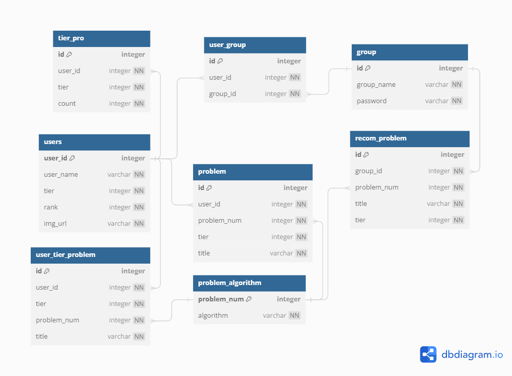

# TIL (Today I Learned)

# 11월 14일 화요일

# 😃 What I Learned

### [Spring 에서 외부 API 사용하기](https://jie0025.tistory.com/531)

- RestTemplate vs WebClient
    - 동기 vs 비동기
    - 느림 vs 빠름

## [Rest Template](https://blog.naver.com/hj_kim97/222295259904) 란

- **서버-서버 통신에 사용**한다.
- HpptClient를 추상화해서 제공한다.
- HTTP 서버와의 통신을 단순화하고 Restful 원칙을 지킨다
- 대부분이 다른 API를 호출할 때 RestTemplate를 사용한다.
- Blocking 기반의 동기방식을 사용한다.
- 장점
    - **사용하기 편하고, 직관적이다.**
- 단점
    - **동기적인 HTTP 요청**을 한다. (요청과 응답이 올 때까지 다음 코드로 진행되지 않는다)
    - 커넥션 풀을 기본적으로 사용하지 않아서 연결할 때마다 로컬 포트를 열고, tcp connection을 맺는데
    - 이것을 해결하기 위해 connection pool을 사용해야

- 동기적 요청 & 블로킹 요청

- 비동기적 요청 & 논블로킹 요청

## [**Rest Template](https://adjh54.tistory.com/234) 특징**

- 동기적 요청
- **Http 역직렬화 (MessageConverter)**
- **요청 및 바디의 데이터 형식 변환, 요청 및 응답 헤더의 콘텐츠 형식 설정**
    - Content-Type Header : 요청, 응답에서 전송되는 데이터의 형식
    - Accept Header : 클라이언트가 서버에 요청한 데이터 유형
    - …
    
    ```java
    RestTemplate restTemplate = new RestTemplate();
    HttpHeaders headers = new HttpHeaders();
    headers.add("Content-Type", "application/json"); // 데이터 형식 설정 (text, xml 등)
    headers.add("Authorization", "Bearer <access_token>"); // Authorization 헤더에 Bearer 토큰 추가
    ```
    
- 쿼리의 매개변수를 exchange() 메서드 호출 시 UriComponentsBuilder를 사용하여 설정 가능
- 해당 클래스 내부의 queryParam() 메소드 사용하여 쿼리 매개변수 추가 가능

### Rest Template 사용

1. 의존성 추가
2. 객체 생성
3. Bean 등록하여 Autowired로 주입
4. Header 구성
    
    ```java
    HttpHeaders headers = new HttpHeaders();
    headers.setContentType(MediaType.APPLICATION_JSON);
    // 다양한 ContentType 지정 가능
    ```
    
5. Body 설정, Entity 생성
    1. JSON 형태로 객체 생성하여 전달하려는 값을 넣고
    2. 생성된 객체를 toString()으로 직렬화하여
    3. 그 문자열얼 header포함한 HttpEntity 객체를 생성
6. API 호출
    - exchange 메서드 : HTTP 요청을 보냄 (GET 등 방식 지정)
    - 응답은 ResponseEntity 객체로 반환되며, 반환된 데이터는 String Type의 변수에 할당됨
7. 반환 값 확인 및 사용

- 사용 예시 코드

```java
@Service
@SuppressWarnings("unchecked")
public class MyService {

    @Autowired
    private RestTemplate restTemplate;

    public void myMethod() {
        // Request Header 설정
        HttpHeaders headers = new HttpHeaders();
        headers.setContentType(MediaType.APPLICATION_JSON);

// Request Body 설정
        // ObjectMapper 생성
        ObjectMapper objectMapper = new ObjectMapper();
        // JSON 객체 생성
        ObjectNode requestBody = objectMapper.createObjectNode();
        // requestBody.put("key", "value");

// Request Entity 생성
        HttpEntity entity = new HttpEntity(requestBody.toString(), headers);

// API 호출
        String url = "https://solved.ac/api/v3/user/show?handle=bmike0413";
        ResponseEntity response = restTemplate.exchange(url, HttpMethod.GET, entity, String.class);

// Response Body 출력
        System.out.println(response.getBody());}
}
```

## **ObjectMapper 사용 (Jackson)**

- Maven이 아닌 Gradle을 사용하고 있음으로 ObjectJSON 대신 ObjectMapper 를 사용하자
1. 의존성 추가

```java
dependencies {
    implementation 'com.fasterxml.jackson.core:jackson-databind:2.13.0'
}
```

1. ObjectMapper → ObjectNode **[Jackson]**
    - ObjectNode란 Jackson 라이브러리에서 제공하는 클래스로, JSON 객체를 표현하는 데 사용
    - Jackson은 Java 객체를 JSON으로 변환하거나 JSON을 Java 객체로 변환하는 데 사용되는 강력한 라이브러리

```java
import com.fasterxml.jackson.databind.ObjectMapper;
import com.fasterxml.jackson.databind.node.ObjectNode;

public class MyController {

    public String createJson() throws Exception {
        // ObjectMapper 생성
        ObjectMapper objectMapper = new ObjectMapper();

        // JSON 객체 생성
        ObjectNode jsonObject = objectMapper.createObjectNode();

        // 데이터 추가
        jsonObject.put("name", "John Doe");
        jsonObject.put("age", 30);
        jsonObject.put("city", "New York");

        // JSON 문자열로 변환
        String jsonString = objectMapper.writeValueAsString(jsonObject);

        return jsonString;
    }
}
```

1. 파싱하여 사용
    - JSON은 무조건 String으로 key, value를 관리!

```java
import com.fasterxml.jackson.databind.JsonNode;
import com.fasterxml.jackson.databind.ObjectMapper;

public class MyController {

    public void parseJson(String jsonString) throws Exception {
        // ObjectMapper 생성
        ObjectMapper objectMapper = new ObjectMapper();

        // JSON 문자열을 JsonNode로 파싱
        JsonNode jsonNode = objectMapper.readTree(jsonString);

        // 데이터 추출
        String name = jsonNode.get("name").asText();
        int age = jsonNode.get("age").asInt();
        String city = jsonNode.get("city").asText();

        // 추출한 데이터 사용
        System.out.println("Name: " + name);
        System.out.println("Age: " + age);
        System.out.println("City: " + city);
    }
}
```

### 직렬화 vs 역직렬화

- 직렬화
    - 자바 객체를 외부 저장소에 저장하거나 네트워크를 통해 전송하기 위해 객체를 데이터 스트림으로 변환하는 과정
    - 객체의 필드값이 데이터 스트림에 쓰여진다
- 역직렬화
    - 반대로 데이터 스트림으로부터 객체를 재구성하는 과정
    - 이 과정에서 데이터 스트림이 어떤 객체인지 알아야하기 떄문에 객체의 클래스 정보가 함께 전달되어야

# dbdiagram

[A Free Database Designer for Developers and Analysts](https://dbdiagram.io/d/655325cd7d8bbd646522ce44)



### SQL PK → FK 연결

- 반드시 PK 여아.. 하는건 아닌데 유일성이 보장되어야 하는듯
- 그냥 FK를 연결할 때는 PK랑 연결하는 것이 일반적
- 만약 N : M으로 연결한다면 중간 테이블을 사용하여 **A_PK > C_1, C_2 < B_PK**

### [Solved.ac](http://Solved.ac) api

- 테스트 결과 v3는 한번에 900회 제한 존재
- 시간은 정확히 모름

## 프로젝트 세팅

**맥 개발 환경 세팅**

- 인텔리 제이 + SpringBoot 확장자 (완료)
- Visual Studio extensions (완료)
- Vue.js npm 설치 (완료)
- MySQL (완료)
- MySQL Workbench (완료)

**SSAFY COM 개발 환경 세팅**

- 인텔리 제이 + SpringBoot 확장자 (완료)
- Visual Studio extensions (완료)
- Vue.js npm 설치 (완료)
- MySQL (완료)
- MySQL Workbench (완료)

# 😜 Today’s Small Happiness

- DB 연동 성공..!
- API 받아오기 성공..!! 흐어엉
- 트래픽 계산하여 API 사용 제한에 따른 로직 구성

# 🧐 Let’s Think About It

- 하지만 동기화된 코드여서 API를 받아오는데 너무 느림, WebClient 사용해야 할 듯

# 🙀 Got Stuck..

-