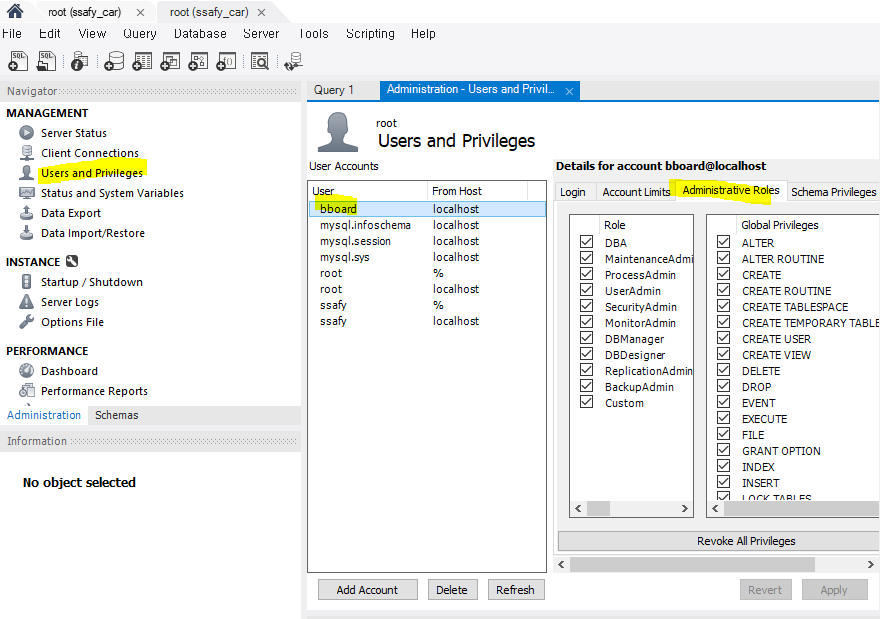

# TIL (Today I Learned)

# 11월 20일 월요일

# 😃 What I Learned

## MySQL 권한 부여 at workbench



```sql
CREATE USER 'bboard'@'localhost' IDENTIFIED BY 'bboard';
GRANT ALL PRIVILEGES ON *.* TO 'bboard'@'%' WITH GRANT OPTION;
FLUSH PRIVILEGES;
```

## JsonNode vs ObjectNode vs ArrayNode

- JsonNode
    - {key:value}
    - Read Only (불변객체)
    - path(), get()
- ObjectNode
    - {key:value}
    - Read & Write
    - path(), get()
    - put()
- ArrayNode
    - [value1, value2, value2]
    - add(), remove()

## ObjectNode를 사용한 ResponseEntity

- 보통은 DTO를 만들어서 전송하나 복잡하면 ObjectNode를 사용하는 것도 좋다
- 키 : 밸류 (JSON 형태)로 write한다
- put은 deprecated되었음으로 set을 사용하도록 하자

```java
ObjectNode responseJson = JsonNodeFactory.instance.objectNode();
responseJson.set("users", mapper.valueToTree(userList));
responseJson.set("problems", mapper.valueToTree(top100ProblemList));
responseJson.set("userTierProblems", mapper.valueToTree((userTierProblemList)));
responseJson.set("recomProblems", mapper.valueToTree(recomProblemList));
responseJson.set("algorithms", mapper.valueToTree(algorithmList));
```

- 주의점
    1. **JSON 직렬화/역직렬화 이슈:** **`ResponseEntity`**가 JSON으로 변환될 때, Jackson 또는 다른 JSON 라이브러리에서 객체를 어떻게 처리하는지에 따라 문제가 발생할 수 있습니다. 특히 **`ObjectNode`**에는 동적으로 생성된 JSON 데이터가 들어있기 때문에 예측이 어려울 수 있습니다.
    2. **클라이언트와의 호환성:** 클라이언트가 예상하는 형식과 서버에서 반환하는 형식이 잘 맞아야 합니다. 만약 클라이언트가 특정한 JSON 구조를 기대하고 있다면, 이에 맞게 응답을 구성해야 합니다.
    3. **DTO 사용 고려:** 가독성을 높이고 유지보수를 쉽게 하려면 클라이언트와 서버 간의 데이터 전송을 위한 DTO(Data Transfer Object)를 사용하는 것이 좋습니다. 각각의 응답에 대해 해당 DTO 클래스를 만들어서 사용하면 훨씬 명시적이고 관리하기 쉬울 수 있습니다.

## 오늘 구현 내용

1. TierProblem Test
2. **UserTierProblem 동기화**
3. **MainController 작성 (Group Page → Main Page)**
4. **GroupDomain 구성하여 Group 선택 후 Main Page 진입시 관련 정보 받아오는 비즈니스 로직 담당**
    1. 로그인유저 고려하여 front에 필요한 정보만 넘기도록 최적화
    2. **Algorithm 정보 넘길 때 이분탐색 사용**
5. 코드 Refactor
6. 기타
    - package 명 수정
    - 불필요한 코드 삭제
    - 중복 코드 삭제

# 😜 Today’s Small Happiness

- 동기화 코드 잘 구현했다.
- Flux 관련해서 더 자세히 공부하면 동기적으로 작동하는 코드에 대한 이해가 많이 높아질 듯 하다!

# 🧐 Let’s Think About It

- 어떻게 해야 유저를 새로 등록할 때마다 API를 새로 호출하지 않을까?
- Lazy하게 할 방법은 없는가?

# 🙀 Got Stuck..

- 카카오 인턴 밤새 다 써놓고 저장만 하고 제출을 안했다.. 멘탈 깨졌다.. 하 정신 차리자