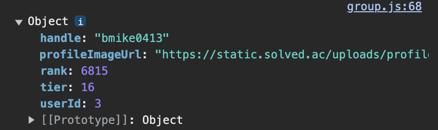

# TIL (Today I Learned)

# 11월 26일 일요일

# 😃 What I Learned

## @JsonProperty와 @JsonNaming

- Json 데이터의 역직렬화 (통신에 유리한 JSON 데이터 등을 객체로 변환하는 작업, 그 반대는 당연히 직렬화) 에 자주 쓰인다
- 보통 snake_case를 camelCase로 변경하는데 많이 쓰인다
- 따라서 보통은 @JsonNaming을 사용하는 것이 편하고 깔끔하다
- 하지만 내가 사용했던 것 처럼 필드명 자체를 바꿔야 하는 경우는 지정하여 JsonProperty를 입력하는 작업이 필요하다.
    - **그러나 여기서 주의! @JsonProperty는 말 그대로 “맵핑”해주는 것이기 때문에 직렬화할 때 다시 역직렬화 하기 전의 key값으로 돌아간다는 것을 주의해야 한다.**
    - **아래 코드는 json input data를 바꾸는 코드이다.**
    - **json data에서는 handle**
    
    ```json
    {
      "handle": "bmike0413",
      "profileImageUrl": "https://static.solved.ac/uploads/profile/bmike0413-picture-1690439048194.png",
      "solvedCount": 304,
      "tier": 16,
      "rating": 1602,
    	"rank": 6815,
    ...
    }
    ```
    
    - **Back에서 역직렬화할 때는 userName으로 맵핑하여 사용한다.**
    
    ```java
    @Data
    @JsonIgnoreProperties(ignoreUnknown = true)
    public class User {
    
        private int userId;
        @JsonProperty("handle")
        private String userName;
        private int tier;
        @JsonProperty("rank")
        private int solvedRank;
        @JsonProperty("profileImageUrl")
        private String imgUrl;
    }
    ```
    
    - **그러나 이를 front로 다시 직렬화하여 전송하면 다시 handle이 된다.**
    
    
    

- 보통 snake_case를 camelCase로 변경할 때의 예시

```java
public class OAuthToken {

    @JsonProperty("access_token")
    private String accessToken;
    @JsonProperty("refresh_token")
    private String refreshToken;
    @JsonProperty("token_type")
    private String tokenType;
    private String name;
    @JsonProperty("expires_in")
    private int expiresIn;
    private String scope;
}
```

```java
@JsonNaming(PropertyNamingStrategy.SnakeCaseStrategy.class)
public class OAuthToken {

    private String accessToken;
    private String refreshToken;
    private String tokenType;
    private String name;
    private int expiresIn;
    private String scope;
}
```

## Spring 빈 스코프 (김영한 강사)

- 빈 스코프란? : 빈이 존재할 수 있는 범위
- 싱글톤 vs 프로토타입
    - 싱글톤 : **기본 스코프, 스프링 컨테이너의 시작과 종료까지 유지**
    - 프로토타입 : **스프링 컨테이너는 프로토타입 빈의 생성과 의존관계 주입까지만 관여**
- 프로토타입 특징
    - 항상 새로운 인스턴스를 생성, 반환
    - **핵심은 스프링 컨테이너는 프로토타입 빈을 생성하고, 의존관계 주입, 초기화까지만 처리한다는 것이다.** 클라이언트에 빈을 반환하고, 이후 스프링 컨테이너는 생성된 **프로토타입 빈을 관리하지 않는다.**
- Provider
    - ObjectProvider
        - Spring 의존
    - JSR-330 Provider
        - Java 표준

### 웹 스코프

- **웹 환경에서만 동작**
- 프로토타입과 다르게 **스프링이 해당 스코프의 종료시점까지 관리한다. 따라서 종료 메서드가 호출**
- **핵심은 여러 요청이 동시에 오더라도 각자 요청에 따라 개별 bean 으로 관리해준다는 것이다**
- MyLogger 생성을 통한 request scope 활용
    - 사용 이유 : **requestURL 같은 웹과 관련된 정보가 웹과 관련없는 서비스 계층까지 넘어가게 된다,** 서비스 계층에 무관한 정보들은 넘기지 않고 웹 계층에 종속되지 않게 순수하게 유지하는 것이 유지보수 측면에서 좋음
    - 이는 보통 컨트롤러보다는 공통 처리가 가능한 인터셉터나 서블릿 필터에 생성하는 것이 좋음
- 에러
    - **스프링 애플리케이션을 실행하는 시점에 싱글톤 빈은 생성해서 주입해야 하지만, request 스코프 빈은 아직 생성되지 않는다(고객 request가 없음으로).** 이 빈은 실제 고객의 요청이 와야 생성할 수 있다!
- 해결 방법
    1. Provider
        1. **ObjectProvider.getObject()` 를 호출하는 시점까지 request scope 빈의
        생성을 지연**
    2. Proxy
        1. **CGLIB라는 라이브러리로 내 클래스를 상속 받은 가짜 프록시 객체를 만들어서 주입**
- **Provider를 사용하든, 프록시를 사용하든 핵심 아이디어는 진짜 객체 조회를 꼭 필요한 시점까지 지연처리한다는 점이다.**
- 이는 꼭 필요한 곳에서만 사용 (싱글톤이 아니기 때문에 객체가 계속 생성됨으로, 그리고 테스트도 어려워짐)

### 기타

> **@RequiredArgsConstructor**는 **초기화 되지않은 final 필드나, @NonNull 이 붙은 필드에 대해 생성자를 생성 (by Lombok)** 새로운 필드를 추가할 때 다시 생성자를 만들어서 관리해야하는 번거로움을 없애준다. (@Autowired를 사용하지 않고 의존성 주입)
> 

# 😜 Today’s Small Happiness

- 너무 오랜만의 주말!

# 🧐 Let’s Think About It

- 

# 🙀 Got Stuck..

-